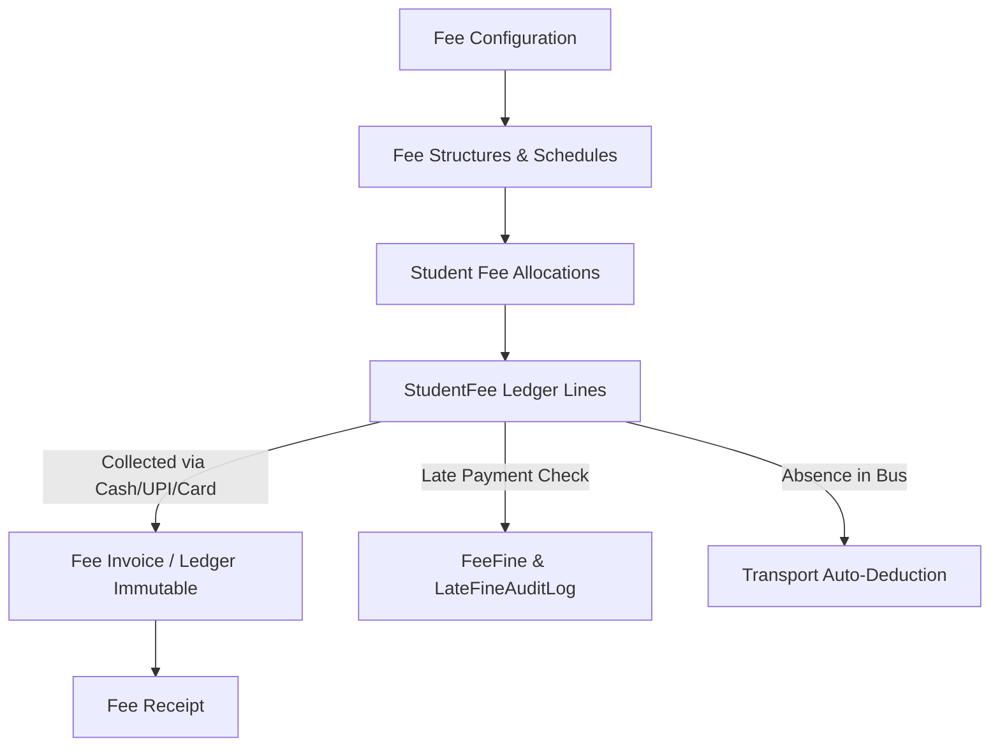
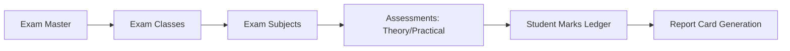

# SchoolCloud ERP — Comprehensive Database Documentation (DATABASE.md)

This document provides a complete, production-grade schema and relational mapping of the **SchoolCloud ERP** multi-tenant database. It covers database architecture, multi-tenant isolation, table structures, foreign key constraints, column definitions, indexing strategies, data types, and lifecycle rules across all ERP functional modules.

---

## 1. Architectural Principles & Tenancy Model

### 1.1 Multi-Tenant Global Isolation
* **Tenant Root Model**: The `School` model (`schools` table) is the root tenant anchor for all operations.
* **Tenant Partitioning**: Every tenant-owned table contains a `school_id` foreign key referencing `schools(id)` with `onDelete('cascade')` or strict domain isolation.
* **Automatic Query Scoping**:
  * Eloquent models utilize the `BelongsToSchool` trait ([BelongsToSchool.php](file:///c:/Users/souha/Downloads/ERP%20Project/School%20Erp/app/Models/Traits/BelongsToSchool.php)).
  * The global scope `SchoolScope` automatically applies `where('school_id', session('current_school_id') ?? auth()->user()->school_id)` to every `SELECT`, `UPDATE`, and `DELETE` query unless explicitly bypassed via `withoutGlobalScope(SchoolScope::class)`.
* **Domain & Session Tenancy Resolution**:
  * Resolved by `IdentifySchoolByDomain` middleware via HTTP host, domain alias, or request header `X-School-Code`.

### 1.2 Immutability & Financial Auditability
* **Financial Ledger Immutability**:
  * Models like `FeeInvoice`, `LateFineAuditLog`, and `InventoryStockLog` are append-only.
  * Standard updates and deletions on these tables throw runtime exceptions (`RuntimeException`), except for restricted status transitions (e.g. `cancelled` status on invoices).
* **Double-Entry & Voucher Controls**:
  * Expenses (`school_expenses`, `expense_vouchers`, `voucher_payments`) and Incomes (`school_incomes`, `income_vouchers`, `voucher_receipts`) maintain double verification with approval workflows and account transfers.

### 1.3 JSON Casting & Dynamic Attributes
* Dynamic form extensions, customizations, and settings are stored as JSON attributes:
  * `students.custom_fields` — Custom dynamic student demographic attributes.
  * `fee_invoices.payment_details` — Payment gateway payloads, cheque numbers, bank metadata.
  * `report_card_templates.design_settings` — CSS, layout, header, footer, signature coordinates.
  * `schools.disabled_modules` / `schools.disabled_features` — Feature matrix flags.

---

## 2. Global Entity-Relationship Overview

```mermaid
erDiagram
    SCHOOLS ||--o{ USERS : "has many"
    SCHOOLS ||--o{ ACADEMIC_SESSIONS : "defines"
    SCHOOLS ||--o{ SCHOOL_CLASSES : "manages"
    SCHOOLS ||--o{ STUDENTS : "enrolls"
    SCHOOLS ||--o{ STAFF : "employs"
    SCHOOLS ||--o{ FEE_STRUCTURES : "configures"
    SCHOOLS ||--o{ TRANSPORT_ROUTES : "operates"
    SCHOOLS ||--o{ EXAMS : "conducts"
    SCHOOLS ||--o{ INVENTORY_PRODUCTS : "stocks"
    SCHOOLS ||--o{ LIBRARY_BOOKS : "catalogs"

    SCHOOL_CLASSES ||--o{ SECTIONS : "has"
    SCHOOL_CLASSES ||--o{ SUBJECTS : "teaches"
    
    STUDENTS ||--o{ STUDENT_SESSIONS : "academic history"
    STUDENTS ||--o{ STUDENT_ATTENDANCES : "daily logs"
    STUDENTS ||--o{ STUDENT_FEES : "incurred fees"
    STUDENTS ||--o{ FEE_INVOICES : "receives"
    STUDENTS ||--o{ STUDENT_MARKS : "scores"
    STUDENTS ||--o{ STUDENT_LEAVE_APPLICATIONS : "submits"
    STUDENTS ||--o{ STUDENT_GATE_PASSES : "issues"

    STAFF ||--o{ STAFF_ATTENDANCES : "daily logs"
    STAFF ||--o{ STAFF_PAYROLLS : "earns"
    STAFF ||--o{ STAFF_LEAVE_APPLICATIONS : "applies"
    STAFF ||--o{ CLASS_TIMETABLE_CELLS : "teaches"
    STAFF ||--o{ SECTION_SUBJECT_STAFF : "assigned to"

    TRANSPORT_ROUTES ||--o{ STOPS : "includes"
    TRANSPORT_ROUTES ||--o{ VEHICLE_TRIPS : "schedules"
    VEHICLES ||--o{ VEHICLE_TRIPS : "executes"
    VEHICLES ||--o{ VEHICLE_EXPENSES : "incurs"
    
    EXAMS ||--o{ EXAM_CLASSES : "applies to"
    EXAMS ||--o{ EXAM_SUBJECTS : "examines"
    EXAM_SUBJECTS ||--o{ EXAM_ASSESSMENTS : "grades"
```



---

## 3. Subsystem Schema & Table Catalog

### 3.1 Tenant, Authentication & Access Control

#### `schools`
Stores tenant profiles, domain mappings, GPS attendance boundaries, and global module overrides.
* **Columns**:
  * `id` (BIGINT, PK, Auto-increment)
  * `name` (VARCHAR) — Official school title.
  * `code` (VARCHAR, Unique) — Short tenant slug (e.g. `SCH001`).
  * `custom_domain` (VARCHAR, Nullable, Unique) — White-label host mapping.
  * `email`, `phone`, `alternate_phone` (VARCHAR)
  * `address`, `city`, `state`, `pincode`, `country` (VARCHAR/TEXT)
  * `logo`, `favicon`, `signature`, `stamp` (VARCHAR) — Asset storage paths.
  * `status` (ENUM: `active`, `inactive`, `suspended`) — Subscription status.
  * `latitude`, `longitude`, `geofence_radius_meters` (DECIMAL/INT) — Campus GPS coordinates for mobile punch-in.
  * `staff_punch_in_start`, `staff_punch_in_end`, `staff_punch_out_start`, `staff_punch_out_end` (TIME) — Working shifts.
  * `udise_code`, `affiliation_number`, `board` (VARCHAR) — Educational compliance.
  * `disabled_modules` (JSON) — Globally hidden modules for tenant.
  * `disabled_features` (JSON) — Scoped feature visibility matrix.
  * `sidebar_order` (JSON) — Custom navigation order.
  * `timestamps`

#### `users`
Universal authentication table across Admin, Staff, Teachers, Parents, and Students.
* **Columns**:
  * `id` (BIGINT, PK, Auto-increment)
  * `school_id` (BIGINT, FK -> `schools.id`, Nullable for SuperAdmin)
  * `name` (VARCHAR)
  * `email` (VARCHAR, Nullable)
  * `phone` (VARCHAR, Nullable)
  * `password` (VARCHAR)
  * `user_type` (ENUM: `super_admin`, `school_admin`, `staff`, `teacher`, `student`, `parent`, `driver`)
  * `is_active` (BOOLEAN, Default: `true`)
  * `must_change_password` (BOOLEAN, Default: `false`)
  * `remember_token` (VARCHAR)
  * `timestamps`

#### `plans`, `subscriptions`, `subscription_orders`
SaaS licensing, renewal periods, and billing logs for tenant schools.
* **Key Fields**: `plan_name`, `price_per_month`, `max_students`, `max_staff`, `features_list`, `start_date`, `end_date`, `payment_status`, `gateway_transaction_id`.

#### `module_permissions`, `staff_module_access`
Granular feature-level RBAC overrides complementing Spatie roles & permissions.
* **Key Fields**: `staff_id`, `module_name`, `can_view`, `can_create`, `can_edit`, `can_delete`, `can_export`.

---

### 3.2 Academic Master Structure

#### `academic_sessions`
Manages educational calendar years (e.g. `2025-2026`).
* **Columns**:
  * `id` (BIGINT, PK)
  * `school_id` (BIGINT, FK -> `schools.id`)
  * `name` (VARCHAR) — e.g. `2025-2026`
  * `start_date` (DATE), `end_date` (DATE)
  * `is_current` (BOOLEAN, Default: `false`)
  * `is_locked` (BOOLEAN, Default: `false`) — Locks prior marks and fees when closed.

#### `school_classes` & `sections`
* **`school_classes`**: `id`, `school_id`, `name` (e.g. `Class 10`), `numeric_value` (INT), `stream` (e.g. `Science`, `Commerce`), `order_index`.
* **`sections`**: `id`, `school_id`, `class_id` (FK -> `school_classes.id`), `name` (e.g. `A`, `B`), `capacity` (INT), `room_no`, `class_teacher_id` (FK -> `staff.id`, Nullable).

#### `subjects` & `section_subject_staff`
* **`subjects`**: `id`, `school_id`, `name`, `code`, `type` (`theory`, `practical`, `both`), `credit_hours`, `color` (HEX).
* **`section_subject_staff`**: Pivot mapping linking `section_id`, `subject_id`, `staff_id`, and `academic_session_id`.

#### `student_houses` & `student_categories`
* Master groupings for extracurricular houses (Red, Blue, etc.) and caste/admission categories (General, OBC, SC, ST, EWS).

---

### 3.3 Student Information System (SIS)

#### `students`
Comprehensive student demographic, biological, guardian, and administrative repository.
* **Columns**:
  * `id` (BIGINT, PK)
  * `school_id` (BIGINT, FK -> `schools.id`)
  * `user_id` (BIGINT, FK -> `users.id`, Nullable)
  * `academic_session_id` (BIGINT, FK -> `academic_sessions.id`)
  * `class_id` (BIGINT, FK -> `school_classes.id`)
  * `section_id` (BIGINT, FK -> `sections.id`)
  * `admission_number` (VARCHAR, Unique within school)
  * `roll_number` (VARCHAR, Nullable)
  * `admission_date` (DATE)
  * `first_name`, `middle_name`, `last_name`, `gender`, `dob`, `blood_group`, `religion`, `caste`, `nationality` (VARCHAR)
  * `student_category_id` (FK -> `student_categories.id`), `student_house_id` (FK -> `student_houses.id`)
  * `is_rte` (BOOLEAN, Right To Education quota)
  * `primary_contact` (VARCHAR), `emergency_contact` (VARCHAR)
  * `father_name`, `father_phone`, `father_occupation`, `mother_name`, `mother_phone`, `mother_occupation`, `guardian_name`, `guardian_phone`, `guardian_relation`
  * `current_address`, `permanent_address`, `city`, `state`, `pincode`
  * `student_photo`, `father_photo`, `mother_photo`
  * `fee_schedule_id` (BIGINT, FK -> `fee_schedules.id`, Nullable)
  * `is_schedule_explicit` (BOOLEAN, Default: `false`)
  * `transport_route_id` (FK -> `transport_routes.id`, Nullable), `transport_stop_id` (FK -> `stops.id`, Nullable), `transport_type` (ENUM: `both`, `pickup`, `drop`, `none`), `transport_monthly_fare` (DECIMAL)
  * `custom_fields` (JSON) — Dynamic user-defined form elements.
  * `status` (ENUM: `active`, `inactive`, `alumni`, `transferred`, `suspended`)
  * `soft_deletes`, `timestamps`

#### `student_sessions`
Historical session-by-session academic progression and roll number tracking.
* **Columns**: `id`, `school_id`, `student_id`, `academic_session_id`, `class_id`, `section_id`, `roll_number`, `status` (`promoted`, `retained`, `transferred`), `session_data` (JSON).

#### `student_documents`, `student_cards`, `student_certificates`
* **`student_documents`**: Student attachments (`type`, `title`, `file_path`, `file_size`, `mime_type`).
* **`student_cards` & `card_templates`**: ID card & admit card designer configurations, dimensions, background assets.
* **`student_certificates` & `certificate_templates`**: Transfer Certificates (TC), Character Certificates, and Custom Certificates with serial counters and template design rules.

#### `student_deletion_requests` & `pending_deletions`
Audit trail and two-step verification for safe archiving and student record expungement.

---

### 3.4 Attendance Tracking Subsystem

#### `student_attendances`
Daily and period-wise student classroom attendance records.
* **Columns**:
  * `id` (BIGINT, PK)
  * `school_id` (BIGINT, FK -> `schools.id`)
  * `student_id` (BIGINT, FK -> `students.id`)
  * `academic_session_id` (BIGINT, FK -> `academic_sessions.id`)
  * `class_id` (BIGINT, FK -> `school_classes.id`), `section_id` (BIGINT, FK -> `sections.id`)
  * `date` (DATE)
  * `status` (ENUM: `present`, `absent`, `late`, `half_day`, `holiday`, `medical_leave`)
  * `marked_by` (BIGINT, FK -> `users.id`)
  * `remarks` (VARCHAR)
  * `timestamps`
  * **Unique Index**: `[school_id, student_id, date]`

#### `staff_attendances`
GPS-validated biometric and mobile self-attendance punch logs for teaching and administrative staff.
* **Columns**:
  * `id` (BIGINT, PK)
  * `school_id` (BIGINT, FK -> `schools.id`)
  * `staff_id` (BIGINT, FK -> `staff.id`)
  * `date` (DATE)
  * `punch_in_time` (TIME/DATETIME), `punch_out_time` (TIME/DATETIME)
  * `punch_in_latitude`, `punch_in_longitude`, `punch_out_latitude`, `punch_out_longitude` (DECIMAL)
  * `punch_in_photo`, `punch_out_photo` (VARCHAR)
  * `status` (ENUM: `present`, `absent`, `late`, `half_day`, `on_leave`, `holiday`)
  * `is_verified_geofence` (BOOLEAN)
  * `timestamps`

#### `bus_attendances`
Fleet passenger attendance tracking for transport fee auto-deductions.
* **Columns**: `id`, `school_id`, `student_id`, `vehicle_trip_id`, `date`, `trip_type` (`pickup`, `drop`), `status` (`present`, `absent`), `scanned_by` (FK -> `users.id`).

---

### 3.5 Staff, HR & Payroll Management

#### `departments` & `designations`
* **`departments`**: `id`, `school_id`, `name`, `code`.
* **`designations`**: `id`, `school_id`, `department_id`, `title`, `system_role` (`admin`, `teacher`, `accountant`, `driver`, `librarian`, `other`).

#### `staff`
Staff bio-data, professional qualifications, bank accounts, and payroll classifications.
* **Columns**:
  * `id` (BIGINT, PK)
  * `school_id` (BIGINT, FK -> `schools.id`)
  * `user_id` (BIGINT, FK -> `users.id`)
  * `department_id` (BIGINT, FK -> `departments.id`), `designation_id` (BIGINT, FK -> `designations.id`)
  * `staff_code` (VARCHAR, Unique within school)
  * `first_name`, `last_name`, `gender`, `dob`, `date_of_joining`, `qualification`, `experience_years`
  * `phone`, `emergency_contact`, `email`, `address`
  * `basic_salary` (DECIMAL), `contract_type` (`permanent`, `probation`, `visiting`)
  * `bank_name`, `bank_account_number`, `bank_ifsc`, `pan_number`, `aadhaar_number`
  * `photo`, `resume_path`
  * `status` (ENUM: `active`, `resigned`, `terminated`, `on_leave`)
  * `timestamps`

#### `staff_salary_structures` & `staff_payrolls`
* **`staff_salary_structures`**: Base salary components (`basic`, `hra`, `da`, `special_allowance`, `pf_deduction`, `tax_deduction`, `esi_deduction`).
* **`staff_payrolls`**: Monthly disbursed payroll ledgers (`salary_month_year`, `working_days`, `present_days`, `absent_days`, `attendance_deduction`, `gross_salary`, `total_deductions`, `net_salary`, `status` [ `draft`, `generated`, `paid` ]).
* **`staff_payroll_payments` & `staff_payroll_deposits`**: Bank payout batches, payment vouchers, transaction hashes, and disbursement receipts.

#### `leave_types`, `staff_leave_balances`, `staff_leave_applications`
Leave quota management (Casual Leave, Medical Leave, Earned Leave), accrual rules, approval hierarchies, and supervisor workflow logs.

---

### 3.6 Fee Management System (Dual-Engine / Hybrid Architecture)



#### `fee_configurations`
Global fee rules per school: prefix formats, automated fines, billable days, partial payment rules.
* **Columns**: `id`, `school_id`, `invoice_prefix`, `receipt_prefix`, `fine_grace_period_days`, `auto_fine_enabled`, `fine_type` (`fixed`, `daily_slab`), `fine_amount`, `billable_transport_days_mode`, `invoice_title`, `transport_invoice_title`, `invoice_customizations` (JSON).

#### Master Structure Tables
* **`fee_categories`**: Grouping heads (e.g. `Tuition`, `Admission`, `Examination`, `Transport`, `Hostel`).
* **`fee_components`**: Individual fee items (`category_id`, `name`, `default_amount`, `is_optional`, `is_refundable`).
* **`fee_structures` & `class_wise_fees`**: Class-level standard tariff mappings.
* **`fee_schedules` & `transport_fee_schedules`**: Term/Installment timetable (Monthly, Quarterly, Bi-Annual, Annual) with `due_date`, `fine_start_date`, and installment number associations.
* **`fee_discounts`**: Scholarship and concession master rules (Staff ward, Sibling, Merit, Percentage or Fixed amount).
* **`fee_fines`**: Fine configuration tiers per component.
* **`misc_fees`**: Ad-hoc one-off fees (ID Card re-issue, Library damage, Uniform fees).

#### `student_fees` (Active Fee Ledger Engine)
Stores every fee debit item assigned to a student.
* **Columns**:
  * `id` (BIGINT, PK)
  * `school_id` (BIGINT, FK -> `schools.id`)
  * `student_id` (BIGINT, FK -> `students.id`)
  * `academic_session_id` (BIGINT, FK -> `academic_sessions.id`)
  * `fee_component_id` (BIGINT, FK -> `fee_components.id`, Nullable)
  * `misc_fee_id` (BIGINT, FK -> `misc_fees.id`, Nullable)
  * `fee_schedule_id` (BIGINT, FK -> `fee_schedules.id`, Nullable)
  * `installment_no` (INT, Default: 1)
  * `original_amount` (DECIMAL) — Base tariff before concessions.
  * `amount` (DECIMAL) — Net payable after discounts/adjustments.
  * `paid_amount` (DECIMAL, Default: 0.00) — Total collected to date.
  * `discount_amount` (DECIMAL, Default: 0.00) — Concessions applied.
  * `fine_amount` (DECIMAL, Default: 0.00) — Overdue fines added.
  * `due_date` (DATE)
  * `status` (ENUM: `unpaid`, `partially_paid`, `paid`, `waived`, `cancelled`)
  * `is_fine_applied` (BOOLEAN, Default: `false`)
  * `is_visible` (BOOLEAN, Default: `true`)
  * `timestamps`
  * **Composite Indexes**: `[school_id, student_id, status]`, `[school_id, academic_session_id]`, `[student_id, fee_schedule_id]`.

#### `fee_invoices` (Immutable Collection Ledger)
Created upon payment collection. Implements ledger immutability in model boot rules.
* **Columns**:
  * `id` (BIGINT, PK)
  * `school_id` (BIGINT, FK -> `schools.id`)
  * `student_id` (BIGINT, FK -> `students.id`)
  * `created_by` (BIGINT, FK -> `users.id`) — Accountant / Admin user ID.
  * `invoice_number` (VARCHAR, Unique within school) — Formatted invoice code.
  * `related_invoice_id` (FK -> `fee_invoices.id`, Nullable) — For cancellations/credit notes.
  * `type` (ENUM: `invoice`, `receipt`, `credit_note`, `cancellation`)
  * `status` (ENUM: `paid`, `cancelled`, `refunded`, `pending`)
  * `amount` (DECIMAL) — Cash/digital amount received.
  * `discount_amount` (DECIMAL) — Instant discount offered at counter.
  * `payment_mode` (ENUM: `cash`, `cheque`, `bank_transfer`, `upi`, `pos_card`, `online_gateway`)
  * `payment_date` (DATE)
  * `payment_details` (JSON) — Transaction ID, Bank name, Cheque serial, Gateway response.
  * `remarks` (TEXT)
  * `timestamps`

#### `fee_receipts`, `fee_refunds`, `pending_cheques`, `late_fine_audit_logs`
* **`fee_receipts`**: Printable voucher representations linked to invoices.
* **`pending_cheques`**: Cheque clearance clearinghouse lifecycle (`pending`, `cleared`, `bounced`, `cancelled`).
* **`fee_refunds`**: Formal caution money or excess fee refund disbursements.
* **`late_fine_audit_logs`**: System audit entries detailing automated fine assessments.

---

### 3.7 Transport Fleet Management

#### `vehicles` & `vehicle_documents`
* **`vehicles`**: `id`, `school_id`, `vehicle_no`, `vehicle_model`, `driver_name`, `driver_phone`, `capacity`, `status`.
* **`vehicle_documents`**: Registration certificates, Insurance, Fitness, Pollution (PUC), Permit documents with expiry alerts.

#### `transport_routes`, `stops`, `route_stops`
* **`transport_routes`**: `id`, `school_id`, `name`, `description`, `pick_fare`, `drop_fare`.
* **`stops`**: `id`, `school_id`, `name`, `landmark`, `pick_fare`, `drop_fare`.
* **`route_stops`**: Ordered stops along a route with `sequence_order` and estimated arrival timings.

#### `vehicle_trips` & `vehicle_expenses`
* **`vehicle_trips`**: Shift schedules linking `vehicle_id`, `route_id`, driver, and morning/evening run type.
* **`vehicle_expenses`**: Fuel, maintenance, tolls, and repair costs linked directly to the accounting expense ledger via `school_expense_id`.

---

### 3.8 Examination, Grading & Report Cards



#### `exams`, `exam_classes`, `exam_subjects`, `exam_assessments`
* **`exams`**: `id`, `school_id`, `academic_session_id`, `name` (e.g. `Term 1 Finals`), `start_date`, `end_date`, `grading_system` (`marks`, `grades`, `both`), `is_published`, `settings` (JSON).
* **`exam_classes`**: Classes enrolled in the examination.
* **`exam_subjects`**: Date, start time, end time, max marks, and passing threshold for each subject.
* **`exam_assessments` & `exam_sub_assessments`**: Granular mark breakdowns (e.g., Theory: 70, Internal Assessment: 20, Practical: 10).

#### `grade_scales` & `student_marks`
* **`grade_scales`**: Letter grade mappings (A1, A2, B1, etc.) with min percentage, max percentage, and grade points.
* **`student_marks`**:
  * `id`, `school_id`, `exam_id`, `student_id`, `subject_id`, `exam_assessment_id`.
  * `marks_obtained` (DECIMAL), `is_absent` (BOOLEAN), `is_exempt` (BOOLEAN), `grade` (VARCHAR), `remarks`.
  * **Composite Index**: `[school_id, exam_id, student_id, subject_id]`.

#### `report_card_templates`, `report_card_histories`, `report_card_history_students`
* Dynamic multi-layout report card engine supporting CBSE, ICSE, State Boards, and Custom Rubrics.
* Historical snapshots storing generated PDF buffers, attendance percentages, overall marks, GPA, and teacher remarks.

---

### 3.9 Financial Accounting (Double-Voucher System)

#### Expense Management
* **`expense_heads`**: Accounting categories (e.g., Electricity, Infrastructure, Salary, Printing).
* **`school_expenses`**: Master expense record (`expense_head_id`, `voucher_no`, `amount`, `tax_amount`, `payment_mode`, `vendor_name`, `invoice_date`, `status`).
* **`expense_vouchers` & `voucher_payments`**: Double-entry financial vouchers linking bank accounts and payment confirmations.

#### Income Management & Account Transfers
* **`income_heads`**: Revenue streams outside standard student fees (Grants, Donations, Canteen rent).
* **`school_incomes`**, **`income_vouchers`**, **`voucher_receipts`**: Verified receipts and cash drawer reconciliations.
* **`account_transfers`**: Inter-bank and Cash-in-Hand to Bank balance transfers.

---

### 3.10 Inventory & Asset Management

* **`inventory_categories`**: Item groupings (Stationery, Uniforms, Lab Equipment, IT Hardware).
* **`inventory_products`**: Product SKU, item name, unit type (Pcs, Box, Kg), cost price, selling price, reorder alert level.
* **`inventory_stocks` & `inventory_stock_logs`**: Inward stock purchase ledgers, supplier details, warehouse tracking, and FIFO logs.
* **`inventory_sales` & `inventory_sale_items`**: Point of Sale (POS) sales to students or staff with auto invoice generation and stock deduction.

---

### 3.11 Library Management Subsystem

* **`library_sections` & `library_book_types`**: Shelf rack categorization and genres (Reference, Textbook, Fiction).
* **`library_books`**: Title, ISBN, author, publisher, edition, barcode, total copies, available copies, shelf location.
* **`library_rules`**: Lending policies per user role (Max books allowed, borrowing period in days, daily late fine rate).
* **`library_transactions`**: Circulation logs (`book_id`, `student_id` or `staff_id`, `issue_date`, `due_date`, `return_date`, `fine_amount`, `fine_paid_status`, `status` [`issued`, `returned`, `lost`]).

---

### 3.12 Gate Pass & Visitor Security Management

* **`student_gate_passes`**: Emergency early student departures (`student_id`, `parent_or_guardian_name`, `reason`, `approved_by_staff_id`, `security_out_time`, `qr_code_token`, `status`).
* **`staff_gate_passes`**: Official duty and short-leave staff gate passes.
* **`visitors`**: Front-desk visitor kiosk logs (`name`, `phone`, `purpose`, `person_to_meet`, `check_in_time`, `check_out_time`, `id_proof_number`, `visitor_photo`, `badge_number`).

---

### 3.13 Timetable & Teacher Substitution

* **`timetables` & `timetable_groups`**: Master weekly schedule configurations for academic sessions and class shifts.
* **`timetable_group_periods`**: Daily period bell timings (e.g., Period 1: 08:30 - 09:15, Recess: 11:00 - 11:30).
* **`class_timetable_cells`**: Specific grid cells assigning `day_of_week`, `period_id`, `class_id`, `section_id`, `subject_id`, `staff_id`, and `room_no`.
* **`timetable_substitutions`**: Daily teacher absence substitution scheduler assigning relief teachers to vacant timetable slots.

---

### 3.14 Classroom LMS, Assignments & Daily Tasks

* **`teacher_assignments` & `teacher_assignment_submissions`**: Homework and coursework assignments with deadline dates, file attachments, and student submission grading.
* **`study_materials`**: Digital course content repository (PDFs, PPTs, video links) organized by class and subject.
* **`digital_diaries`**: Daily classroom diary notices and parent communication logs.
* **`daily_task_heads`, `daily_task_questions`, `daily_task_evaluations`, `daily_task_reviews`**: Automated daily question checks and progress rubrics.

---

### 3.15 Communication, Notices, Surveys & Analytics

* **`notices` & `notice_templates`**: Broadcast notices filtered by role target (All, Students, Parents, Teachers) with scheduled publish triggers.
* **`notifications` & `teacher_notifications`**: Push notification dispatch queue, FCM delivery records, and in-app notification state.
* **`surveys`, `survey_questions`, `survey_options`, `survey_responses`**: School satisfaction polls, multiple-choice parent feedback surveys, and statistical aggregation.
* **`chat_messages`**: Secure internal teacher-parent messaging logs.
* **`gallery_posts` & `mobile_app_banners`**: Mobile app dashboard hero sliders, event galleries, and photo archives.
* **`login_logs`, `otp_logins`, `fcm_device_tokens`, `face_vectors`**: Device security, mobile auth tokens, OTP session verification, and biometric AI vectors.

---

## 4. Key Database Constraints, Indexes & Foreign Keys

### 4.1 Core Primary & Foreign Key Conventions
1. **Primary Keys**: Standard unsigned `BIGINT` auto-increment columns named `id`.
2. **Foreign Keys**: Named as `{singular_table}_id` (e.g. `school_id`, `student_id`, `academic_session_id`).
3. **Cascade Rules**:
   * Tenant parent deletion (`schools`) cascades to tenant records (`onDelete('cascade')`).
   * Primary references (`student_id`, `class_id`) use `onDelete('cascade')` for child records (marks, documents, sessions).
   * Financial transactions (`fee_invoices`, `voucher_payments`) strictly use `onDelete('restrict')` to maintain audit preservation.

### 4.2 Critical Composite & Performance Indexes
| Table | Composite Index Columns | Purpose |
| :--- | :--- | :--- |
| `student_fees` | `[school_id, student_id, status]` | Fast lookup of unpaid fee dues in student portal & billing counter |
| `student_fees` | `[school_id, academic_session_id, due_date]` | High-speed batch processing for automated late fine calculation |
| `student_attendances` | `[school_id, student_id, date]` (Unique) | Enforces single daily attendance record per student & fast month queries |
| `staff_attendances` | `[school_id, staff_id, date]` | Staff shift and punch-in lookups |
| `student_marks` | `[school_id, exam_id, student_id, subject_id]` (Unique) | Enforces mark entry uniqueness per assessment |
| `class_timetable_cells`| `[school_id, day_of_week, period_id, staff_id]` | Conflict prevention: Prevents double-booking teachers across sections |
| `fee_invoices` | `[school_id, invoice_number]` (Unique) | Fast invoice search and receipt printing |

---

## 5. Maintenance & Migration Commands Reference

Run these commands inside the `School Erp/` directory:

* **Apply All Migrations**:
  ```bash
  php artisan migrate
  ```
* **Verify Database & Connection Status**:
  ```bash
  php artisan db:show
  php artisan db:table student_fees
  ```
* **Rollback Last Migration Batch**:
  ```bash
  php artisan migrate:rollback
  ```
* **Fresh Database Re-seed (Development Only)**:
  ```bash
  php artisan migrate:fresh --seed
  ```
* **Check Migration Status**:
  ```bash
  php artisan migrate:status
  ```

---
*Document maintained automatically for the SchoolCloud ERP project.*
