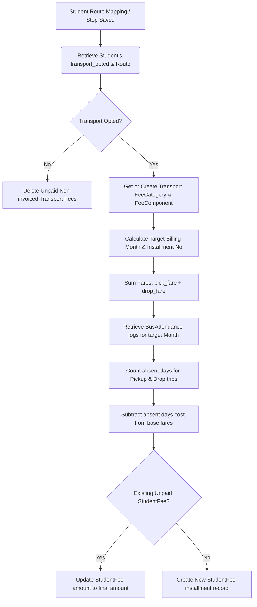

# SchoolCloud ERP — Fees & Transport System Memory

This document details the architecture, data models, logic controllers, configuration properties, and integrations of the **Fees Management** and **Transport Management** modules in the ERP project.

---

## 1. System Integration Overview

The Fees and Transport modules are closely connected:
*   **Transport Setup**: Routes, vehicles, stops, and trips are managed independently.
*   **Student Mapping**: Students are assigned to a route/stop with optional pickup/drop settings, specifying custom monthly pick and drop fares.
*   **Billing/Sync**: The system creates a dedicated `Transport` category and a `Transport Fee` component under the hood. On student route assignment or bus attendance updates, the system invokes `StudentFee::syncTransportFees()`.
*   **Attendance Deductions**: Daily bus attendance is tracked (`BusAttendance`). If a student is marked **absent** for a trip (pickup or drop), the system automatically calculates a daily pro-rata deduction (monthly fare divided by billable days, i.e., days in month excluding Sundays) and reduces their unpaid transport fee invoice dynamically.

---

## 2. Transport Management Module

### A. Data Models & Database Schemas

#### 1. TransportRoute (`transport_routes` table)
Represents a transport route within the school.
*   `school_id` (foreign key to `schools`)
*   `name` (string, required) - e.g., "Route A - North Sector"
*   `description` (string, optional)
*   `pick_fare` (decimal, default: 0.00)
*   `drop_fare` (decimal, default: 0.00)
*   *Accessors / Methods*:
    *   [TransportRoute.php](file:///c:/Users/souha/Downloads/ERP%20Project/School%20Erp/app/Models/TransportRoute.php)
    *   `getTotalFareAttribute()`: Returns the sum of `pick_fare` and `drop_fare`.

#### 2. Stop (`stops` table)
Represents individual pick-up/drop-off stops.
*   `school_id`
*   `name` (string, required) - e.g., "Central Crossing"
*   `landmark` (string, optional)
*   `fare` (decimal, legacy total fare)
*   `pick_fare` (decimal)
*   `drop_fare` (decimal)
*   *Accessors / Methods*:
    *   [Stop.php](file:///c:/Users/souha/Downloads/ERP%20Project/School%20Erp/app/Models/Stop.php)
    *   `getTotalFareAttribute()`: Sum of `pick_fare` + `drop_fare` (falls back to legacy `fare` if split fares are empty).

#### 3. Vehicle (`vehicles` table)
Represents buses, vans, or other transport units.
*   `school_id`
*   `vehicle_no` (string, required) - e.g., "KA-01-F-1234"
*   `vehicle_model` (string, optional)
*   `driver_name` (string, optional)
*   `driver_phone` (string, optional)
*   `capacity` (integer, required)
*   `status` (boolean, default: true/active)
*   [Vehicle.php](file:///c:/Users/souha/Downloads/ERP%20Project/School%20Erp/app/Models/Vehicle.php)

#### 4. VehicleTrip (`vehicle_trips` table)
Schedules particular vehicle runs along a route.
*   `school_id`
*   `vehicle_id` (foreign key to `vehicles`)
*   `route_id` (foreign key to `transport_routes`)
*   `trip_name` (string, required) - e.g., "Morning Shift 1"
*   `type` (enum: `pickup`, `drop`, `both`)
*   `start_time` (string/time, optional)
*   `end_time` (string/time, optional)
*   [VehicleTrip.php](file:///c:/Users/souha/Downloads/ERP%20Project/School%20Erp/app/Models/VehicleTrip.php)

#### 5. BusAttendance (`bus_attendances` table)
Tracks daily student logs on vehicles.
*   `school_id`
*   `student_id` (foreign key to `students`)
*   `date` (date)
*   `trip_type` (string: `pickup` or `drop`)
*   `status` (string: `present` or `absent`)
*   [BusAttendance.php](file:///c:/Users/souha/Downloads/ERP%20Project/School%20Erp/app/Models/BusAttendance.php)

#### 6. VehicleExpense (`vehicle_expenses` table)
Logs maintenance, fuel, and operational costs per vehicle.
*   `school_id`
*   `vehicle_id` (foreign key to `vehicles`)
*   `school_expense_id` (foreign key to main school ledger)
*   `expense_type` (string) - e.g., "Fuel", "Service"
*   `amount` (decimal)
*   `date` (date)
*   `description` (text, optional)
*   `attachment` (string, file path)
*   [VehicleExpense.php](file:///c:/Users/souha/Downloads/ERP%20Project/School%20Erp/app/Models/VehicleExpense.php)

---

### B. Transport Business Logic (`TransportController.php`)

*   **Basics/Dashboard** (`basics`): Gathers statistics (vehicle count, active routes, active stops, trips, student route counts) and sums total expenses.
*   **Vehicles, Stops, Routes CRUD** (`vehicles`, `stops`, `routes`): Standard handlers for managing transport infrastructure.
*   **Trip Scheduling** (`tripMapping`): Sets up trips by linking vehicles, routes, shift timings, and trip directions.
*   **Student Route Assignment** (`studentMapping`):
    *   Saves transport configuration on a student's profile.
    *   If a student is opted in (`isOpted = true` which requires both `transport_route` and `transport_route_id` to be present), the system updates the student's pickup/drop locations, vehicles, times, and monthly fares.
    *   If opted out, all transport-related fields on the student are set to `null` and `transport_opted` is set to `false`.
    *   **Crucial Trigger**: Instantly fires `\App\Models\StudentFee::syncTransportFees($schoolId, $student->id)` to sync billing.
*   **Bus Attendance Logging** (`busAttendance`):
    *   Records daily logs for students who are marked active on transport.
    *   Allows toggling between `pickup` and `drop` trips for a chosen date.
*   **Vehicle Expenses** (`expenses`):
    *   Creates expense transactions. It links to a generic `Transport` `ExpenseHead` to ensure financial reports sync up.
*   **ICS Calendar Export** (`exportCalendar`):
    *   Generates an RFC-5545 compliant `.ics` calendar file for a student containing scheduled daily pickup/drop events (excluding weekends) starting from `transport_calendar_start` for 1 month.
    *   [TransportController.php](file:///c:/Users/souha/Downloads/ERP%20Project/School%20Erp/app/Http/Controllers/School/TransportController.php)

---

## 3. Fees Management Module

### A. Data Models & Database Schemas

#### 1. AcademicSession (`academic_sessions` table)
Defines the current calendar year boundary for fees/configurations.
*   `school_id`, `name`, `start_date`, `end_date`, `is_current`
*   [AcademicSession.php](file:///c:/Users/souha/Downloads/ERP%20Project/School%20Erp/app/Models/AcademicSession.php)

#### 2. FeeCategory (`fee_categories` table)
Categorization label for ledger groups.
*   `school_id`, `name`, `description`
*   [FeeCategory.php](file:///c:/Users/souha/Downloads/ERP%20Project/School%20Erp/app/Models/FeeCategory.php)

#### 3. FeeSchedule (`fee_schedules` table)
Specifies class-wise payment installment rules.
*   `school_id`, `academic_session_id`, `classes` (JSON/string list), `no_of_installments`, `name`, `start_date`, `end_date`
*   [FeeSchedule.php](file:///c:/Users/souha/Downloads/ERP%20Project/School%20Erp/app/Models/FeeSchedule.php)

#### 4. FeeComponent (`fee_components` table)
Individual billing items linked to a schedule.
*   `school_id`, `academic_session_id`, `fee_schedule_id`, `head_name`, `component_name`, `admission_type`, `gender`
*   [FeeComponent.php](file:///c:/Users/souha/Downloads/ERP%20Project/School%20Erp/app/Models/FeeComponent.php)

#### 5. ClassWiseFee (`class_wise_fees` table)
Defines fee structures for a class/section under a schedule and student category.
*   `school_id`, `academic_session_id`, `class_id`, `section_id` (optional), `fee_schedule_id`, `student_category_id`, `fee_component_id`, `is_active`, `amount`, `installments` (JSON array)
*   [ClassWiseFee.php](file:///c:/Users/souha/Downloads/ERP%20Project/School%20Erp/app/Models/ClassWiseFee.php)

#### 6. StudentFee (`student_fees` table)
Calculated fee line items representing individual student invoices.
*   `school_id`, `student_id`, `fee_category_id`, `fee_schedule_id`, `fee_component_id`, `installment_no`, `amount`, `due_date`, `paid_amount`, `instant_discount_amount`, `instant_discount_type`, `status`, `invoice_no`, `invoice_status`
*   *Scopes & Hooks*:
    *   **Global Scope ('active')**: Excludes cancelled or refunded invoices from active queries.
    *   `syncTransportFees()`: Updates transport billing for a student.
    *   [StudentFee.php](file:///c:/Users/souha/Downloads/ERP%20Project/School%20Erp/app/Models/StudentFee.php)

#### 7. FeeInvoice (`fee_invoices` table)
Holds transaction ledger details.
*   `school_id`, `student_id`, `created_by`, `invoice_number`, `related_invoice_id`, `related_invoice_number`, `installment_no`, `type`, `status`, `amount`, `discount_amount`, `payment_mode`, `payment_date`, `payment_details`
*   *Ledger Policy*: **Fee Invoices are immutable**. The `updating` and `deleting` database model events trigger `RuntimeException` to prevent changes to transaction history (except status column updates).
*   [FeeInvoice.php](file:///c:/Users/souha/Downloads/ERP%20Project/School%20Erp/app/Models/FeeInvoice.php)

#### 8. FeeReceipt (`fee_receipts` table)
Generated slip confirming a processed payment.
*   `school_id`, `student_id`, `receipt_number`, `amount_paid`, `discount_amount`, `discount_type`, `payment_mode`, `transaction_id`, `payment_date`, `payment_details`, `status`
*   *Scopes*: Global Scope ('active') filters out `cancelled` receipts.
*   [FeeReceipt.php](file:///c:/Users/souha/Downloads/ERP%20Project/School%20Erp/app/Models/FeeReceipt.php)

#### 9. FeeDiscount (`fee_discounts` table)
Defines billing concessions.
*   `school_id`, `academic_session_id`, `name`, `remarks`, `classes_installments` (JSON list of classes), `amount`, `type` (flat/percentage), `student_ids` (JSON array, optional)
*   [FeeDiscount.php](file:///c:/Users/souha/Downloads/ERP%20Project/School%20Erp/app/Models/FeeDiscount.php)

#### 10. FeeFine (`fee_fines` table)
Calculates penalties for late payments.
*   `school_id`, `academic_session_id`, `name`, `fine_type`, `fine_amount`, `status`
*   [FeeFine.php](file:///c:/Users/souha/Downloads/ERP%20Project/School%20Erp/app/Models/FeeFine.php)

#### 11. FeeRefund (`fee_refunds` table)
Tracks processed reversals and refunds.
*   `school_id`, `student_id`, `student_fee_id`, `amount`, `payment_mode`, `refund_date`, `reason`
*   [FeeRefund.php](file:///c:/Users/souha/Downloads/ERP%20Project/School%20Erp/app/Models/FeeRefund.php)

---

### B. Core Features & Business Logic (`FeeManagementController.php`)

*   **Fee Configuration** (`feeConfiguration`):
    *   Handles layout selection (A4 Portrait, etc.), copy counts, default modes, receipts date edit rights, and parent-side controls.
    *   Initializes `FeeConfiguration` defaults if absent (`ensureFeesSeeded`).
*   **Basics Setup** (`feeBasics`):
    *   CRUD interfaces for academic sessions, schedules, components, discounts, and fines.
*   **Class-Wise Fee Allocation** (`classWiseFee`):
    *   Defines structured installments for class profiles.
    *   Invokes `syncClassWiseFeeToStudents()` to push configurations to student records.
*   **Synchronizing Student Fees** (`syncStudentFees`):
    *   Triggered on student creation, update, promotion, or profile edit.
    *   Translates class configurations into individual `StudentFee` records.
    *   Excludes or removes outstanding unpaid invoices if a student moves classes, schedules, or categories.
    *   Automatically runs `syncStudentDiscounts()` to apply concession logic.
*   **Applying Concessions** (`syncStudentDiscounts`):
    *   Scans available `FeeDiscount` models.
    *   Applies discounts (percentage-based or flat rates) to outstanding unpaid installments, updating the `instant_discount_amount` parameter.
    *   Protects partially-paid installments from retroactive discount resets.
    *   [FeeManagementController.php](file:///c:/Users/souha/Downloads/ERP%20Project/School%20Erp/app/Http/Controllers/School/FeeManagementController.php)

---

## 4. Integration: Transport Billing and Daily Deductions

The core integration resides in [StudentFee.php](file:///c:/Users/souha/Downloads/ERP%20Project/School%20Erp/app/Models/StudentFee.php#L66-L207) via the static `syncTransportFees` function:

### Pro-Rata Absentee Calculation Details
1.  **Billable Days Calculation**:
    *   Counts total days in the billing month.
    *   Subtracts Sundays.
    *   If billable days $\le 0$, falls back to a default of $26$ days.
2.  **Daily Cost Allocation**:
    *   Daily Pickup Cost = $\text{Monthly Pick Fare} / \text{Billable Days}$
    *   Daily Drop Cost = $\text{Monthly Drop Fare} / \text{Billable Days}$
    *   Total Daily Cost = $\text{Daily Pickup Cost} + \text{Daily Drop Cost}$
3.  **Absence Deductions**:
    *   Pickup Deduction = $\text{Absent Pickup Count} \times \text{Daily Pickup Cost}$
    *   Drop Deduction = $\text{Absent Drop Count} \times \text{Daily Drop Cost}$
4.  **Final Monthly Fare**:
    $$\text{Final Fare} = \max(0, \text{Monthly Pick Fare} - \text{Pickup Deduction}) + \max(0, \text{Monthly Drop Fare} - \text{Drop Deduction})$$

This dynamic sync ensures that parents are only billed for trips where the student was actually present or did not have an recorded absence, automatically calculated on every profile sync or transport schedule mapping change.
