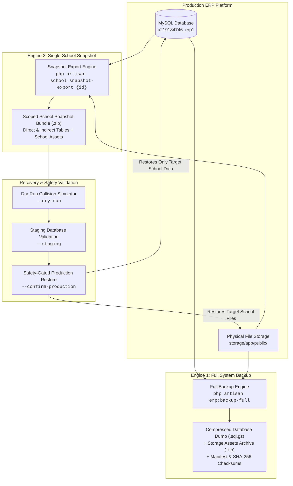
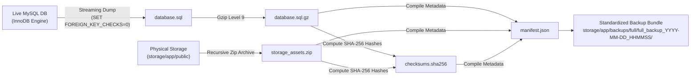
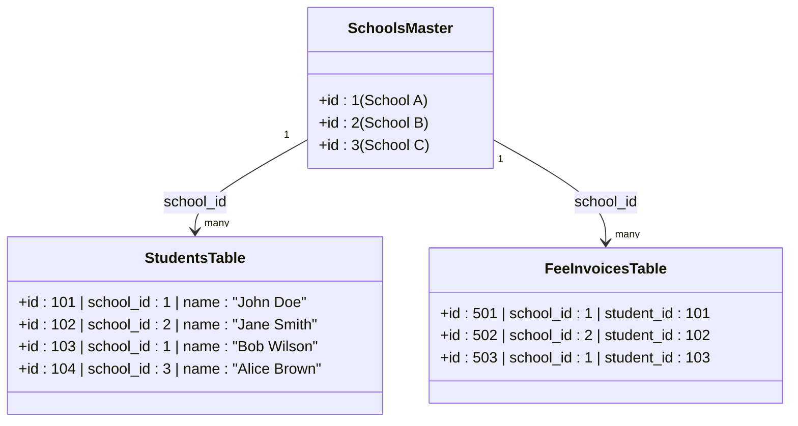
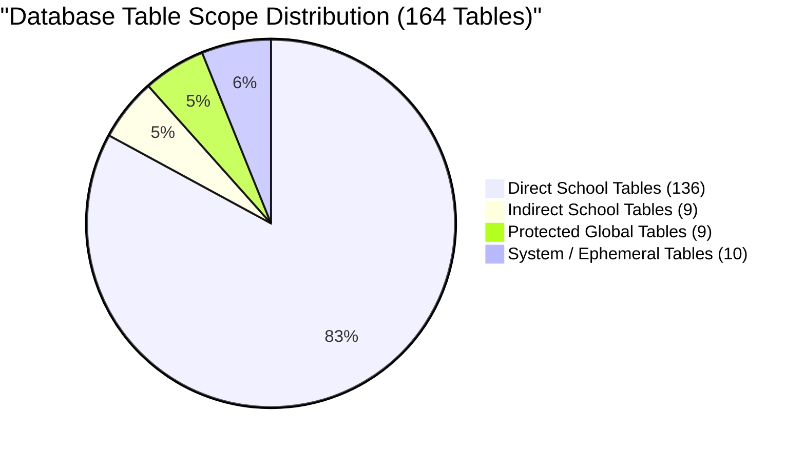
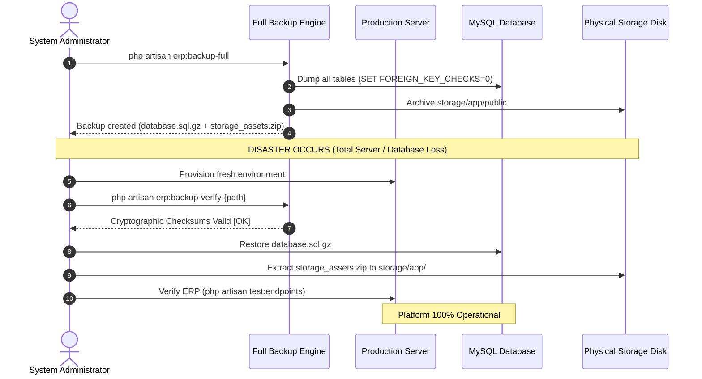
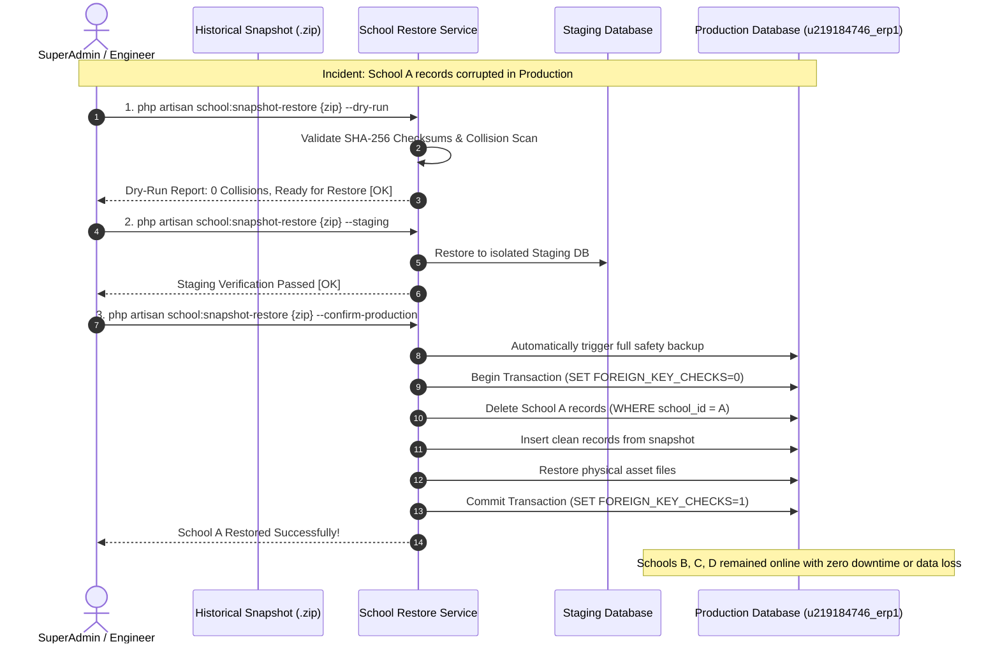

# Disaster Recovery & Single-School Backup Architecture

---

## 1. Executive Summary

This document describes the Disaster Recovery (DR), Full System Backup, and Single-School Backup and Recovery architecture implemented for the **SchoolCloud ERP** platform.

The ERP operates on a **Shared Database and Shared Schema** architecture, where multiple educational institutions (schools) share the same MySQL database instance while remaining logically separated using a tenant identifier (`school_id`). 

To meet enterprise compliance and business continuity requirements, the disaster recovery architecture provides two distinct recovery capabilities:

1. **Full Disaster Recovery (Platform-Wide)**: Protects the entire ERP platform against catastrophic hardware failure, hosting provider outages, or complete database corruption by providing full, transactional MySQL database backups paired with physical storage asset archives.
2. **Single-School Recovery (Tenant-Specific)**: Enables selective point-in-time recovery for an individual school without rolling back or altering data belonging to any other school on the platform.



---

## 2. Existing ERP Database Architecture

The production database is configured as follows:

* **Database Name**: `u219184746_erp1`
* **Database Engine**: MySQL (InnoDB engine)
* **Character Set**: `utf8mb4` (Multi-byte Unicode support)
* **Architecture Pattern**: Shared Database + Shared Schema + Row-Level Logical Isolation

### Multi-Tenant Model
All school tenants share the same physical database and tables. Separation is enforced through:
* **Primary Key Anchor**: The `schools` table acts as the tenant master registry.
* **Direct Tenant Scoping**: Business tables contain a `school_id` column referencing `schools.id`.
* **Application-Level Scoping**: Eloquent models utilize the `BelongsToSchool` trait and `SchoolScope` global query filter, automatically applying `WHERE school_id = ?` to all read and write queries.
* **Referential Cascades**: Foreign keys are configured with `ON DELETE CASCADE` or `ON DELETE SET NULL` to maintain relational integrity.

---

## 3. Backup Architecture (Full System Backup Engine)

The Full Backup Engine creates a complete, standalone copy of the entire ERP platform, covering both relational data and physical files.



### 3.1 Technical Components
1. **Transactional Database Dump**:
   * Uses streaming PDO chunking to extract table schemas, indexes, foreign keys, auto-increment sequences, and table records.
   * Includes `SET FOREIGN_KEY_CHECKS = 0;` at the start and `SET FOREIGN_KEY_CHECKS = 1;` at the end to prevent foreign key ordering conflicts during restoration.
   * Handles circular nullable references (such as `fee_components` $\leftrightarrow$ `fee_schedules` $\leftrightarrow$ `fee_fines`) without deadlock.
2. **Gzip Stream Compression**: Compresses the SQL dump to `.sql.gz` to minimize storage requirements.
3. **Storage Asset Archive**: Recursively compresses all uploaded assets (student photos, staff documents, homework attachments, certificates, fee receipts) from `storage/app/public/` into `storage_assets.zip`.
4. **Cryptographic Checksum Verification**: Calculates individual SHA-256 hashes for both database and file archives, writing them to `checksums.sha256`.
5. **Manifest Generation**: Generates `manifest.json` recording total table counts, row counts per table, file counts, byte sizes, database engine, and timestamp.
6. **Automated Retention Policy**: Automatically prunes backup folders older than a configurable retention window (default: 14 days).

### 3.2 CLI Commands

#### Execute Full Backup
```bash
php artisan erp:backup-full --clean-older-than=14
```

#### Verify Backup Integrity
```bash
php artisan erp:backup-verify storage/app/backups/full/full_backup_2026-08-27_120000
```

### 3.3 Protection Scope
A full backup protects against:
* Total server or storage disk hardware failure.
* Complete database loss or corruption.
* Hosting provider or infrastructure failure.
* Ransomware or server-wide security breaches.

---

## 4. Single-School Snapshot Architecture

The School Snapshot Engine extracts and packages the complete operational state of an individual school into a self-describing, portable `.zip` bundle.

```
storage/app/snapshots/school_{id}_{code}_{timestamp}.zip
├── manifest.json            # School identity, table catalog, row stats, and file list
├── checksums.sha256         # Cryptographic SHA-256 hashes for every file and data table
├── data/                    # JSON data files for all 145 tenant tables
│   ├── students.json
│   ├── fee_invoices.json
│   ├── student_attendances.json
│   ├── model_has_roles.json
│   └── ...
└── files/                   # Physical uploaded files referenced by this school's records
    ├── students/photos/...
    ├── staff-photos/...
    ├── diary_attachments/...
    └── ...
```

### 4.1 Data Extraction Model

The snapshot engine reads data across **145 tenant-scoped tables**:

1. **Direct School-Scoped Tables (136 tables)**:
   * Extracted using direct filtering: `SELECT * FROM table WHERE school_id = ?`.
   * Covers core academics, admissions, fees, timetables, examinations, transport, inventory, payroll, and user logins.
2. **Indirect School-Scoped Tables (9 tables)**:
   * Tables that do not contain a direct `school_id` column but belong to the school through parent relationships:
     * `designation_staff`: `WHERE staff_id IN (SELECT id FROM staff WHERE school_id = ?)`
     * `inventory_sale_items`: `WHERE sale_id IN (SELECT id FROM inventory_sales WHERE school_id = ?)`
     * `login_logs`: `WHERE user_id IN (SELECT id FROM users WHERE school_id = ?)`
     * `model_has_roles`: `WHERE model_type = 'App\Models\User' AND model_id IN (SELECT id FROM users WHERE school_id = ?)`
     * `model_has_permissions`: `WHERE model_type = 'App\Models\User' AND model_id IN (SELECT id FROM users WHERE school_id = ?)`
     * `survey_questions`: `WHERE survey_id IN (SELECT id FROM surveys WHERE school_id = ?)`
     * `survey_options`: `WHERE survey_id IN (SELECT id FROM surveys WHERE school_id = ?)`
     * `survey_responses`: `WHERE survey_id IN (SELECT id FROM surveys WHERE school_id = ?)`
     * `teacher_assignment_submissions`: `WHERE assignment_id IN (SELECT id FROM teacher_assignments WHERE school_id = ?)`
3. **Physical Asset Discovery**:
   * Scans exported records for file path references (`photo`, `file_path`, `document`, `attachment`, `logo`, `signature`, `stamp`).
   * Bundles only the physical files matching those references from `storage/app/public/` into the `files/` folder of the snapshot.

### 4.2 CLI Command

```bash
php artisan school:snapshot-export {school_id}
```

---

## 5. Single-School Restore Architecture

The restoration architecture enforces a three-stage safety pipeline to prevent data loss or cross-tenant interference.

```mermaid
stateDiagram-v2
    [*] --> SnapshotPackage: Load .zip snapshot
    SnapshotPackage --> ChecksumVerification: Validate SHA-256 Hashes
    ChecksumVerification --> DryRun: Execute --dry-run
    
    state DryRun {
        [*] --> CollisionScan: Check PK ID overlap with other schools
        CollisionScan --> CountDiff: Calculate rows to delete/insert
        CountDiff --> SafetyVerdict: Generate Safety Report
    }

    DryRun --> StagingRestore: Execute --staging (Optional Verification)
    
    state StagingRestore {
        [*] --> StagingDB: Restore into isolated Staging DB
        StagingDB --> FunctionalCheck: Verify integrity & relationships
    }

    DryRun --> ProductionRestore: Execute --confirm-production
    
    state ProductionRestore {
        [*] --> PreBackup: Take Full Safety Backup
        PreBackup --> BeginTx: DB::beginTransaction()
        BeginTx --> PurgeOld: Delete target school rows (Reverse DAG)
        PurgeOld --> InsertNew: Insert snapshot rows (Topological Order)
        InsertNew --> CopyFiles: Extract files to storage/app/public/
        CopyFiles --> CommitTx: DB::commit()
    }
    
    ProductionRestore --> [*]: Restore Complete
```

### Stage 1: Dry-Run Simulation (`--dry-run`)
* **Mode**: 100% Read-Only.
* **Operation**:
  * Unpacks snapshot archive into a temporary memory/disk sandbox.
  * Verifies all cryptographic SHA-256 checksums.
  * Compares snapshot table structures against the current database schema.
  * Scans for **Primary Key ID Collisions**: Checks whether any IDs in the snapshot are currently used by *another* school in production.
  * Calculates the exact number of existing rows to be replaced and new rows to be inserted.
  * Returns a summary report with a safety verdict (`READY_FOR_RESTORE` or `BLOCKED_BY_COLLISIONS`).

```bash
php artisan school:snapshot-restore storage/app/snapshots/school_1_SCH001_2026-08-27_120000.zip --dry-run
```

### Stage 2: Staging Database Restore (`--staging`)
* **Mode**: Isolated Non-Production Environment.
* **Operation**:
  * Restores the snapshot into a designated staging database connection (e.g. `staging`).
  * Allows administrators to verify row counts, foreign-key relationships, and data completeness before touching production.

```bash
php artisan school:snapshot-restore storage/app/snapshots/school_1_SCH001_2026-08-27_120000.zip --staging --staging-db=staging
```

### Stage 3: Safety-Gated Production Restore (`--confirm-production`)
* **Mode**: Production Execution with Automatic Safety Safeguards.
* **Operation**:
  1. **Safety Block Check**: Requires the explicit `--confirm-production` flag; otherwise, the command automatically defaults to dry-run mode.
  2. **Mandatory Pre-Restore Backup**: Automatically triggers a full database backup (`erp:backup-full`) immediately before modifying any records.
  3. **Interactive Confirmation**: Prompts the operator for confirmation, clearly displaying the target school name and affected row count.
  4. **Atomic Transaction Scope**: Enclosed entirely within a database transaction (`DB::beginTransaction()`).
  5. **Foreign-Key Safeguards**: Executes with foreign key checks temporarily disabled (`SET FOREIGN_KEY_CHECKS = 0;`).
  6. **Surgical Tenant Purge**: Deletes existing records belonging *only* to the target `school_id` across all 145 tenant tables in reverse dependency order.
  7. **Topological Ingestion**: Inserts snapshot records table-by-table in topological dependency order.
  8. **Physical Asset Restoration**: Copies referenced physical files from the snapshot into `storage/app/public/`.
  9. **Commit & Rollback**: Re-enables foreign key checks and executes `DB::commit()`. If any unexpected error occurs, `DB::rollBack()` is triggered immediately, leaving the database unchanged.

```bash
php artisan school:snapshot-restore storage/app/snapshots/school_1_SCH001_2026-08-27_120000.zip --confirm-production
```

---

## 6. Disaster Recovery Scenarios

| Incident / Scenario | Recovery Method | Recovery Scope | Impact on Other Schools |
| :--- | :--- | :--- | :--- |
| **Complete Server / Database Loss** | Full Database Restore (`.sql.gz`) + Storage Asset Archive (`.zip`) | Entire ERP Platform | All schools restored to backup timestamp. |
| **Storage Disk Corruption** | Storage Asset Archive Restore (`storage_assets.zip`) | All physical files | No database impact; missing files restored. |
| **Single School Data Corruption** | School Snapshot Recovery (`school:snapshot-restore`) | Target School Only | **Zero Impact**. All other schools remain online. |
| **Accidental School Record Deletion** | School Snapshot Recovery (`school:snapshot-restore`) | Target School Only | **Zero Impact**. All other schools remain online. |
| **Pre-Restore Safety Verification** | Dry-Run Simulation (`--dry-run`) | Read-Only Analysis | **Zero Impact**. No data modified. |
| **Staging Recovery Testing** | Staging Restore (`--staging`) | Staging Database | **Zero Impact**. Production untouched. |

---

## 7. Implemented Safety Controls

1. **Read-Only Dry-Run Mode**: Default behavior prevents accidental writes by requiring explicit flags for any database changes.
2. **Mandatory Pre-Restore Full Backup**: An automatic platform-wide backup is generated before any production tenant restore begins.
3. **Cryptographic SHA-256 Validation**: Every data file and physical asset is verified against hash manifests prior to extraction or restoration.
4. **Primary Key Collision Detection**: Scans destination tables to ensure restored IDs do not conflict with records owned by other schools.
5. **Database Transaction Envelope**: Production restores run within `DB::beginTransaction()` and `DB::rollBack()` to prevent partial or corrupted states.
6. **Foreign-Key Cycle Management**: Disables foreign key checks during batch ingestion to resolve nullable cyclic dependencies safely.
7. **Reverse-Dependency Deletion**: Purges old tenant records in reverse hierarchical order to respect relational integrity.
8. **Protected Global Data Filtering**: Explicitly excludes platform-wide tables (`schools`, `plans`, `roles`, `permissions`, `sessions`) from tenant restoration scopes.

---

## 8. Data Isolation Model

The multi-tenant architecture uses row-level partitioning across shared database tables:



### Operational Principle:
* Records for School A (`school_id = 1`), School B (`school_id = 2`), and School C (`school_id = 3`) coexist within the same physical tables (`students`, `fee_invoices`, `student_attendances`).
* Single-school snapshot and restoration routines scope their operations strictly to the target `school_id`.
* Restoring School A deletes and re-inserts only rows where `school_id = 1`, leaving records where `school_id = 2` or `school_id = 3` completely untouched.

---

## 9. Global & System Data Protection

The architecture classifies every database table to prevent accidental overwrites of platform infrastructure:



### Protected Categories (Excluded from Single-School Restore)

1. **Global Platform Tables (9 tables)**:
   * `schools` (Platform Master Anchor)
   * `plans`, `subscriptions`, `subscription_orders` (SaaS Billing & Subscriptions)
   * `demo_bookings`, `school_requests` (Public Website Onboarding Leads)
   * `roles`, `permissions`, `role_has_permissions` (Global RBAC Authorization Matrix)
2. **System & Ephemeral Tables (10 tables)**:
   * `cache`, `cache_locks` (Application Cache)
   * `jobs`, `job_batches`, `failed_jobs` (Background Queue Workers)
   * `sessions`, `password_reset_tokens`, `personal_access_tokens`, `otp_logins` (Authentication & Security Tokens)
   * `import_logs` (Temporary Bulk Upload History)

---

## 10. Physical File and Asset Recovery

File assets are uploaded to `storage/app/public/` across several directories:

* **Student Photos**: `students/photos/`
* **Student Documents**: `students/documents/`
* **Staff Photos & Documents**: `staff-photos/`, `staff-documents/{id}/`
* **School Branding**: `school-logos/`, `school-stamps/`, `school-signatures/`
* **Academic Attachments**: `assignments/`, `study_materials/`, `diary_attachments/`
* **Transport Documents**: `vehicle_documents/{school_id}/`
* **Front Desk / Visitors**: `visitors/{school_id}/`

### Asset Handling Strategy:
* **Export**: The snapshot service parses database columns containing file path references and copies only the files belonging to that school into the snapshot archive.
* **Restore**: Files from the snapshot bundle are extracted into `storage/app/public/`, ensuring photos, documents, and attachments are recovered in sync with their database records.

---

## 11. End-to-End Recovery Workflows

### 11.1 Full Disaster Recovery Workflow



### 11.2 Single-School Recovery Workflow



---

## 12. Implemented Artisan CLI Commands

| Command | Signature | Purpose & Behavior |
| :--- | :--- | :--- |
| **Full Backup** | `php artisan erp:backup-full {--clean-older-than=14}` | Creates a complete `.sql.gz` dump + `storage_assets.zip` bundle and prunes old archives. |
| **Verify Backup** | `php artisan erp:backup-verify {path}` | Validates archive structure, manifest data, and SHA-256 cryptographic hashes. |
| **Snapshot Export** | `php artisan school:snapshot-export {school_id}` | Read-only extraction of an individual school's data (145 tables) and referenced files into a `.zip` bundle. |
| **Dry-Run Restore** | `php artisan school:snapshot-restore {path} --dry-run` | Read-only simulation checking for primary key collisions and row diffs without modifying data. |
| **Staging Restore** | `php artisan school:snapshot-restore {path} --staging {--staging-db=staging}` | Restores the snapshot into a dedicated staging database connection for verification. |
| **Production Restore** | `php artisan school:snapshot-restore {path} --confirm-production` | Executes transactional, safety-gated restore on production with automatic pre-restore backup. |

---

## 13. Operational Safety Principles

1. **Never use full database backups to fix single-school incidents**: Restoring a full database backup in a shared database architecture will overwrite and roll back all other schools on the platform.
2. **Always execute a Dry-Run first**: Use `--dry-run` to identify primary key collisions or schema incompatibilities prior to restoration.
3. **Validate on Staging**: Where possible, test the snapshot restore against a staging database before applying to production.
4. **Mandatory Safety Backups**: The system automatically generates a complete backup before executing any production restore.
5. **Protect Global Data**: Global billing, user roles, permissions, and active login sessions must never be overwritten during tenant-level recovery.
6. **Synchronized Asset Recovery**: Always ensure physical storage files are restored alongside relational database records to prevent broken image links and missing documents.

---

## 14. Important Recovery Consideration: Snapshot Timing

> [!IMPORTANT]
> **Point-in-Time Recovery Principle**:
> * A snapshot created **after** a data corruption or accidental deletion incident will capture the corrupted state.
> * True point-in-time recovery requires a **pre-incident historical snapshot** (e.g. taken yesterday or last week) or extraction from a historical full database backup.
> * For proactive protection, scheduled snapshot exports or daily full backups should be maintained according to institutional retention policies.

---

## 15. Architecture Summary

The implemented architecture is structured as:

$$\text{Shared Database} + \text{Shared Schema} + \text{school\_id Row Isolation}$$
$$+$$
$$\text{Full System Backup} + \text{School Snapshot Engine}$$
$$+$$
$$\text{Dry-Run Validation} + \text{Staging Verification} + \text{Safety-Gated Production Restore}$$

---

## 16. Implementation Status & Scope

### Implementation Status
All components documented above are **fully implemented and operational** in the codebase:
* Core Backup Engine: [`app/Services/Backup/BackupService.php`](file:///c:/Users/souha/Downloads/ERP%20Project/School%20Erp/app/Services/Backup/BackupService.php)
* Tenant Snapshot Engine: [`app/Services/Backup/SchoolSnapshotService.php`](file:///c:/Users/souha/Downloads/ERP%20Project/School%20Erp/app/Services/Backup/SchoolSnapshotService.php)
* Tenant Restore Engine: [`app/Services/Backup/SchoolRestoreService.php`](file:///c:/Users/souha/Downloads/ERP%20Project/School%20Erp/app/Services/Backup/SchoolRestoreService.php)
* Full Backup Command: [`app/Console/Commands/FullBackupCommand.php`](file:///c:/Users/souha/Downloads/ERP%20Project/School%20Erp/app/Console/Commands/FullBackupCommand.php)
* Backup Verify Command: [`app/Console/Commands/BackupVerifyCommand.php`](file:///c:/Users/souha/Downloads/ERP%20Project/School%20Erp/app/Console/Commands/BackupVerifyCommand.php)
* Snapshot Export Command: [`app/Console/Commands/SchoolSnapshotExportCommand.php`](file:///c:/Users/souha/Downloads/ERP%20Project/School%20Erp/app/Console/Commands/SchoolSnapshotExportCommand.php)
* Snapshot Restore Command: [`app/Console/Commands/SchoolSnapshotRestoreCommand.php`](file:///c:/Users/souha/Downloads/ERP%20Project/School%20Erp/app/Console/Commands/SchoolSnapshotRestoreCommand.php)

### Documentation Scope
This document describes the disaster recovery and school backup/restore capabilities as currently built and verified in the application. It does not describe theoretical or unbuilt functionality.
